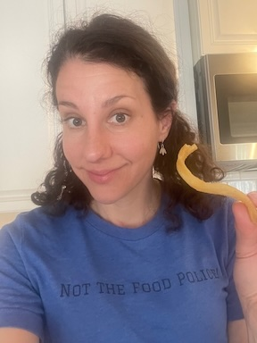

## Greta Breskin, MS, RD, LDN, CSP (she/her)
Hello! My name is Greta Breskin and I am a Registered Dietitian and a Board-Certified Specialist in Pediatric Nutrition. 

<sp>I completed my master’s degree in nutrition education and dietetic internship at Columbia University in New York City in 2013. Shortly after moving to North Carolina in 2015, I joined the clinical nutrition team at UNC Children’s Hospital in Chapel Hill, where I cared for newborns through young adults with a variety of common and rare medical conditions. 

Four of my seven years at UNC were spent in the outpatient Children’s Specialty Clinics specializing in the nutrition care of children with feeding difficulties and gastrointestinal diseases. I have expert knowledge of and experience with dietary therapies for pediatric Crohn’s disease.

My professional passion for counseling families was strengthened by my lived experience parenting twins. In 2022 I left my role at the UNC Hospital system to work in private practice pediatric nutrition counseling. If you are struggling with feeding your child, you are not alone, and I can help!

I provide nutrition assessment and counseling for infants, children, and adolescents through [FuelNC Nutrition](https://www.fuelnc.com). I apply nutrition interventions and feeding frameworks backed by scientific literature to help each family I work with achieve their goals. 

To supplement my knowledge of nutrition, I completed evidenced-based sleep education courses. I integrate these concepts into my nutrition counseling work when relevant. I also provide comprehensive sleep coaching services through [Little Dipper Sleep](https://www.littledipperwellness.com).